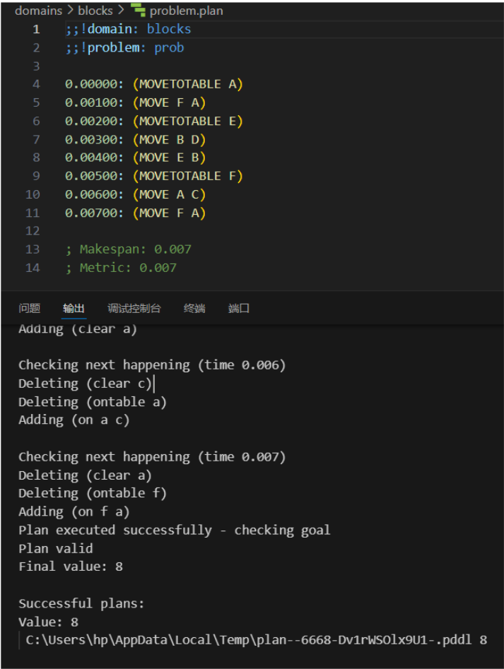

# 
PDDL(Planning Domain Description Language)

## 效果展示

## 算法原理
### PDDL

规划涉及定义一个规划问题，这包括两个关键组件：领域（domain）和问题（problem）。领域定义了规划语言的语法规则，它包括可用的操作、这些动作的参数、以及动作执行的前提条件和效果。此外，领域还定义了问题中涉及的对象类型和谓词。问题定义则具体化了规划任务，它描述了规划的起始状态和目标状态。起始状态列出了所有对象的初始情况，而目标状态则描述了规划成功完成后所期望达到的状态。定义好规划问题后，接下来是求解过程。这个阶段通常由 PDDL 规划器来执行，它使用搜索算法来寻找从起始状态到目标状态的路径。规划器会尝试执行一系列动作，每个动作都满足其前提条件，并且将起始状态转换为一个新的状态。这个过程会持续进行，直到达到目标状态或者确定不存在解决方案。在搜索过程中，规划器会利用领域定义中的逻辑规则来推理状态的变迁，确保每个中间状态都是合法的。此外，为了提高效率，现代规划器通常会采用启发式搜索策略，如 A*搜索或基于 SAT 的规划，来减少需要探索的状态空间。找到解决方案后，规划器会生成一个计划，该计划是一系列有序的动作，按照这个顺序执行可以完成规划任务。

### 论域和问题定义

1）block

只定义物体这一种类型的数据；定义两种动作，move 表示将 x 移动到 y 上，moveToTable 表示将物体 x 移动到桌子上；定义三种谓词，clear 表示 x 物体上面没有其他物体，ontable 表示物体 x 在桌子上面，on 表示物体 x 在 y 上面。动作序列 move，将 x 移动到 y 物体上时需要考虑三个物体的状态，物体 x 是否为空，物体 y 是否为空，如果物体 x 下面本来有物体 z，如何更新物体 z 的状态。
动作序列 moveTotable，将 x 移动到桌子上需要考虑两个物体的状态，物体 x 是否为空，以及如果物体 x 下面本来有物体 z，如何更新物体 z 的状态。

2）15-puzzle

定义两种类型的数据，num 表示数字（位置可变），loc 表示网格（位置不可变）；定义三种谓词，at 表示数字 n 是否在网格 l 上，adjacent 表示网格 l1 和 l2是否相邻，这决定了他们上面的数字是否可以交换，在动作序列的过程中，网格li 和 lj 的相对位置保持不变；定义一种动作 slide，表示数字和空格进行交换。动作序列 slide，将网格 l1 上的数字 n 和网格 l2 上的空格进行交换，交换的前提条件为 l2 是空格，l1 上面存在数字，并且网格 l1 和 l2 相邻，交换后注意更新数字在网格上位置的变化，以及网格 l1 置空。

